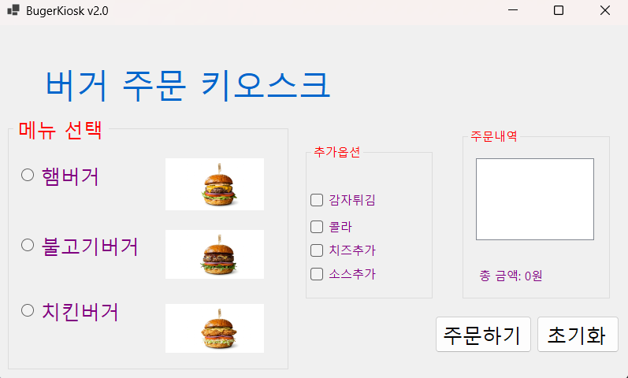
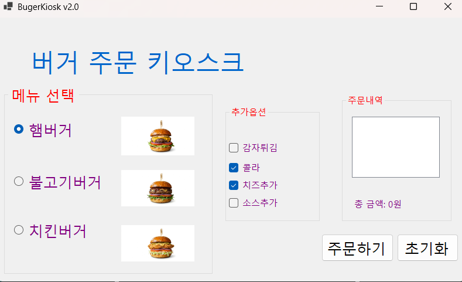
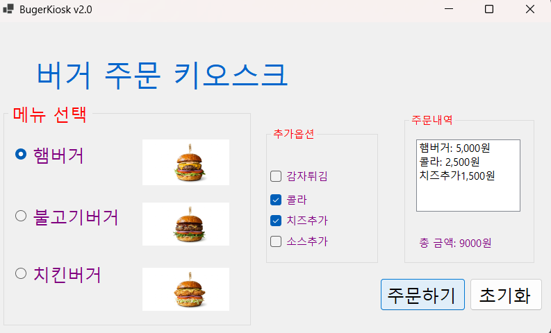
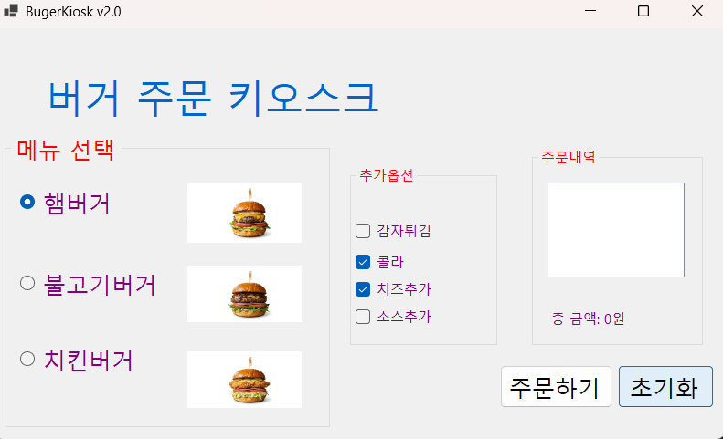
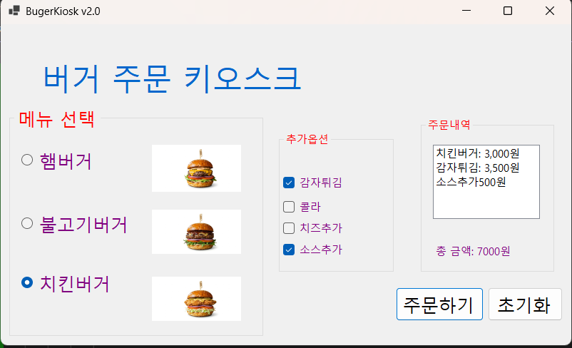
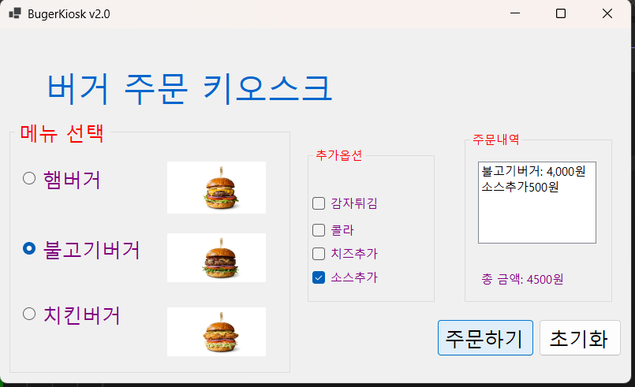

## 개요
- C# 프로그래밍 학습
- 1줄 소개: 햄버거 키오스크
- 사용한 플랫폼:
 - C#, .NET Windows Forms, Visual Studio, GitHub
- 사용한 컨트롤:
 - Label, ListBox, GroupBox, CheckBox, RadioButton, PictureBox, Button
- 사용한 기술과 구현한 기능:
 - if문을 이용하여 선택된 물건마다 변경되는 사항 적용

 ## 실행 화면 (과제1) 
 - 과제1 코드의 실행 스크린샷

- 과제 내용
- RadioButton(햄버거선택), CheckBox(사이드 선택), GroupBox(묶음)
- RadioButton을 사용하여 선택사항중 하나를 고를 수 있게 만듬
-  CheckBox를 사용하여 사이드를 중복선택 할 수 있게 만듬
- GroupBox를 사용하여 RadioButton끼리 묶고 CheckBox끼리 묶어서 깔끔하게 보이게함
- 계산하기를 누르면 가격이 합쳐져서 보이게함

- 사용한 기술과 구현한 기능:
- RadioButton을 활용하여 햄버거, 불고기버거, 치킨버거 중 단 하나만 선택할 수 있도록 구현함
- CheckBox를 활용하여 감자튀김, 콜라, 치즈, 소스 등 여러 가지 항목을 중복 선택할 수 있도록 구현함
- 사용자가 선택한 메뉴와 옵션을 확인하여 각 항목의 가격을 합산하고, 주문 목록(ListBox)에 텍스트로 추가한다.
- 선택된 모든 항목의 총액(TotalCost)을 계산하여 하단 레이블(lblTotal)에 실시간으로 업데이트한다.
- 초기화 버튼을 누르면 합계 금액이 0으로 리셋되고, 리스트박스에 담긴 주문 내역이 모두 삭제되어 새로운 주문을 받을 수 있는 상태가 된다.